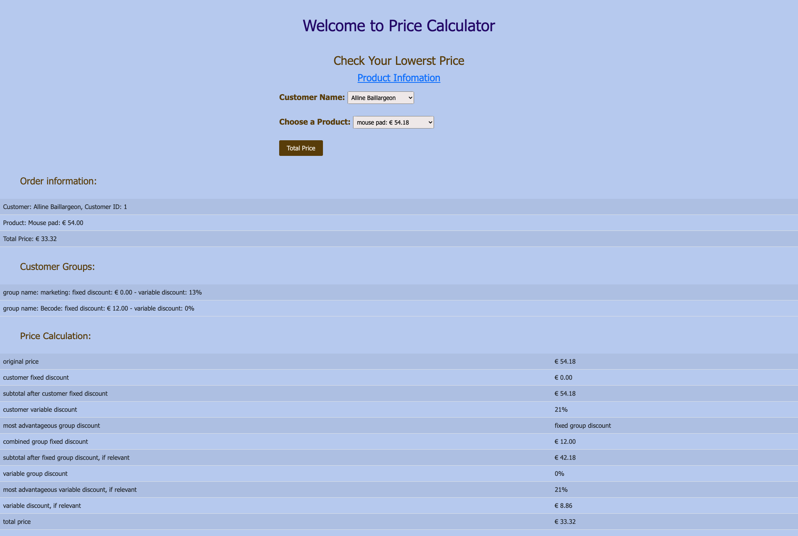

# Title: PHP Price Calculator challenge

- Repository: `php-pricecalculator-challenge`
- Type of Challenge: `Learning challenge`
- Duration: `7/11/2021 - 12/11/2021`
- Deployment strategy : `NA`
- Team challenge : `pairs`

# Contributors:
- [Naama Kaplan](https://github.com/N-Kaplan)
- [Xiaoqi Li](https://github.com/830503)

# Mission
- Apply OOP in PHP
- Learn MVC
- Import data with a database
- Make a price calculator with 3 entities:
    1) Customer
    2) Customer group
    3) Product

# Checklist
- [x] Make repository
- [x] Import database and connect to localserver
- [x] Create MVC structure
- [x] Make Connection class in Model
- [x] Make Customer, CustomerGroup, Product classes in Model
- [x] Make CustomerLoader, CustomerGroupLoader, ProductLoader classes in Model
- [x] Make DotEnv class in Model
- [x] Make Calculator and CalculatorDispaly classes in Model
- [x] Make Homepge, infoPage, header and footer in View
- [x] Make HomepageController, InfoController in Controller
- [x] Make .env and .gitignore file
- [x] Create dropdown list
- [x] Get selected values from dropdown
- [x] Searching discount based on customerId
- [x] Searching discount based on groupId
- [x] Searching discount based on parentId
- [x] Calculate the price and no negative prices
- [x] Create a table to display how the price is calculated
- [x] Add a category page for the different products

# Notes for implementation
The database used for this exercise was provided with the [instructions](https://github.com/becodeorg/ANT-Lamarr-5.34/tree/main/2.The-Hill/php/6.oop-pricecalculator) and can be found [here](https://github.com/becodeorg/ANT-Lamarr-5.34/tree/main/2.The-Hill/php/6.oop-pricecalculator/resources). 

Create a .env file in the project's root folder with the following structure:\
DBSERVER = your local host name \
DBUSER = your username \
DBPASSWORD = your database password \
DBNAME = your database name 

